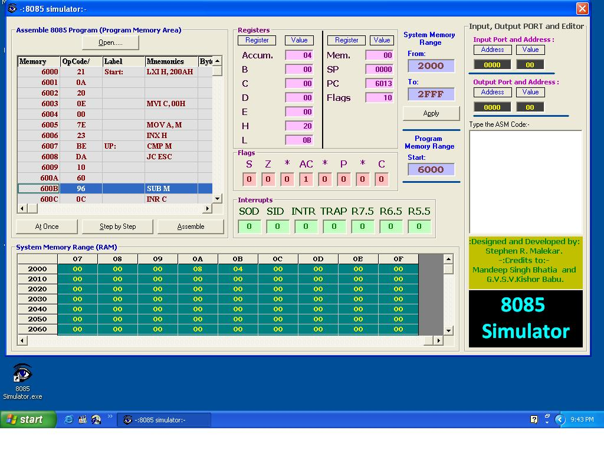



## A 8085 Simulator

### Description

This is the 8085 Simulator. It is the best on the planet for now. Download and run. 8085 programs are also included. It is nearly matching the Industrial (Commercial) standards.
 
### More Info
 
User needs to have good understanding of Hexadecimal, Binary, Decimal and Octal Sys. Some instructions like DAA may not work properly at times.

             |
---                |---
**Submitted On**   |2010-01-13 21:45:32
**By**             |[Stephen R\. Malekar](https://github.com/Planet-Source-Code/PSCIndex/blob/master/ByAuthor/stephen-r-malekar.md)
**Level**          |Advanced
**User Rating**    |4.5 (18 globes from 4 users)
**Compatibility**  |VB 6\.0
**Category**       |[Complete Applications](https://github.com/Planet-Source-Code/PSCIndex/blob/master/ByCategory/complete-applications__1-27.md)
**World**          |[Visual Basic](https://github.com/Planet-Source-Code/PSCIndex/blob/master/ByWorld/visual-basic.md)
**Archive File**   |[A\_8085\_Sim2173131192010\.zip](https://github.com/Planet-Source-Code/stephen-r-malekar-a-8085-simulator__1-72839/archive/master.zip)

